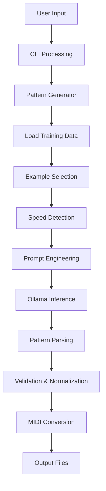

# PyDrums Architecture Overview

This document provides a detailed technical overview of how PyDrums processes user prompts and generates drum patterns using AI and few-shot learning.

## System Flow

When a user runs `pydrums generate -d "Create a funky beat"`, the system follows this flow:

```
CLI Input → Pattern Generator → Example Selection → Prompt Engineering → Ollama → Pattern Output
```

## 1. CLI Entry Point (`cli.py`)

### Command Processing (`cli.py:119-134`)
```python
def generate_command(args):
    generator = PatternGenerator(args.model, args.data_dir)
    
    if args.interactive:
        generator.interactive_mode()
        return
    
    # Generate patterns
    results = generator.batch_generate(descriptions, ...)
```

The CLI handles:
- Argument parsing and validation
- Interactive vs batch mode selection
- Model and data directory configuration
- Automatic MIDI conversion after generation

## 2. Pattern Generation Core (`pattern_generator.py`)

### Main Generation Method (`pattern_generator.py:39-111`)
```python
def generate_pattern(self, description: str, **kwargs) -> Dict[str, Any]:
    # 1. Load training data
    if not self.training_data:
        return self._generate_basic_pattern(description)
    
    # 2. Find relevant examples and detect speed
    relevant_examples, detected_speed, used_random_fallback = self._find_relevant_examples(
        description, style_hint, num_examples
    )
    
    # 3. Create few-shot learning prompt
    prompt = self._create_prompt(description, relevant_examples)
    
    # 4. Generate using Ollama
    response = ollama.chat(model=self.model_name, messages=[{'role': 'user', 'content': prompt}])
    
    # 5. Parse and validate result
    pattern_data = self._parse_generated_pattern(response['message']['content'])
    
    return pattern_data
```

### Training Data Structure
The system loads 1,331+ pre-processed training examples from `data/training_data.json`:

```json
{
    "input": "Create a funk drum pattern",
    "output": "bd: x---x---x---x---; sd: ----X--_----X-_-; ch: x-x-x-x-x-x-x-x-",
    "style": "funk",
    "speed": "normal",
    "pattern_length": 16,
    "time_signature": "4/4",
    "source_pattern": "funk_groove_1"
}
```

## 3. Example Selection System (`pattern_generator.py:113-206`)

### Relevance Scoring Algorithm
```python
def _find_relevant_examples(self, description: str, style_hint: Optional[str], num_examples: int):
    scored_examples = []
    keywords = description.lower().split()
    
    for example in self.training_data:
        score = 0
        example_text = example.get('input', '').lower()
        example_style = example.get('style', '').lower()
        example_speed = example.get('speed', 'normal')
        
        # Keyword scoring
        for keyword in keywords:
            if keyword in example_text:
                score += 2  # Description match
            if keyword in example_style:
                score += 3  # Style match bonus
        
        # Speed matching bonus
        if detected_speed and detected_speed == example_speed.replace('_', '-'):
            score += 5
        
        if score > 0:
            scored_examples.append((score, example))
    
    # Return top examples
    return [ex[1] for ex in sorted(scored_examples, key=lambda x: x[0], reverse=True)[:num_examples]]
```

### Speed Detection (`pattern_generator.py:624-655`)
The system detects speed variations from natural language:

```python
speed_patterns = {
    'half-time': ['half time', 'halftime', 'slow', 'laid back', 'relaxed'],
    'double-time': ['double time', 'fast', 'rapid', 'uptempo', 'quick'],
    'quarter': ['quarter notes', 'simple', 'basic', 'four on the floor']
}
```

## 4. Prompt Engineering (`pattern_generator.py:208-273`)

### Few-Shot Learning Prompt Structure
```python
def _create_prompt(self, description: str, examples: List[Dict[str, Any]]) -> str:
    prompt_parts = [
        "You are a professional drum pattern generator. Create ONLY the drum pattern using this notation:",
        "",
        "NOTATION GUIDE:",
        "- x = hit/strike the drum (accent)",
        "- X = loud hit (forte)", 
        "- o = medium hit",
        "- _ = ghost note (quiet hit/pianissimo)",
        "- - = rest/silence",
        # ... full notation guide
        "",
        "EXAMPLES:",
        ""
    ]
    
    # Add training examples
    for i, example in enumerate(examples, 1):
        prompt_parts.extend([
            f"Example {i}:",
            f"INPUT: {example.get('input', '')}",
            f"OUTPUT: {example.get('output', '')}",
            ""
        ])
    
    prompt_parts.extend([
        "Now generate a pattern for:",
        f"INPUT: {description}",
        "OUTPUT:"
    ])
    
    return "\n".join(prompt_parts)
```

## 5. Data Processing Pipeline (`data_loader.py`)

### Training Data Generation (`data_loader.py:112-146`)
Raw patterns from GitHub sources are processed into training examples:

1. **Pattern Normalization**: All patterns normalized to 16-beat length
2. **Speed Variations**: Each pattern generates 4 variants (normal, half-time, double-time, quarter-notes)
3. **Style Classification**: Auto-detection of musical styles from pattern names
4. **Quality Enhancement**: Musical dynamics and proper notation conversion

### Speed Variation Generation (`data_loader.py:425-482`)
```python
def _generate_speed_variations(self, pattern_str: str, style: str, time_sig: str, name: str):
    variations = []
    
    # Half-time: snare on beat 3, sparser feel
    if style_supports_halftime:
        half_time_pattern = self._create_improved_half_time_pattern(pattern_str)
        variations.append({
            "input": f"Create a half-time {style} groove",
            "output": half_time_pattern,
            "speed": "half_time",
            "pattern_length": 16  # Still 16 chars but different emphasis
        })
    
    # Double-time: more frequent hits, faster feel  
    if style_supports_doubletime:
        double_time_pattern = self._create_improved_double_time_pattern(pattern_str)
        variations.append({
            "input": f"Create a double-time {style} beat", 
            "output": double_time_pattern,
            "speed": "double_time",
            "pattern_length": 16
        })
    
    return variations
```

## 6. Ollama Integration (`pattern_generator.py:74-86`)

### AI Model Communication
```python
response = ollama.chat(
    model=self.model_name,  # Default: "llama3.1:latest"
    messages=[{
        'role': 'user',
        'content': prompt
    }],
    options={
        'temperature': temperature,  # Default: 0.7
        'top_p': 0.9,
        'max_tokens': 500
    }
)
```

The system uses Ollama's local inference capabilities, ensuring privacy and eliminating API dependencies.

## 7. Pattern Processing & Validation

### Output Parsing (`pattern_generator.py:275-316`)
```python
def _parse_generated_pattern(self, generated_text: str) -> Dict[str, Any]:
    # Find valid pattern lines with drum notation
    pattern_lines = []
    for line in generated_text.split('\n'):
        if ':' in line and any(drum in line.lower() for drum in ['ch', 'sd', 'bd']):
            pattern_lines.append(line)
    
    # Join and normalize
    pattern_line = "; ".join(pattern_lines)
    pattern_line = self._clean_and_normalize_pattern(pattern_line)
    
    return {
        'pattern_line': pattern_line,
        'drum_patterns': self._extract_drum_patterns(pattern_line),
        'is_valid': self._validate_pattern(pattern_line)
    }
```

### Pattern Normalization (`pattern_generator.py:372-413`)
Ensures consistent 16-beat patterns by:
- Repeating shorter patterns to fill 16 beats
- Truncating longer patterns
- Maintaining musical integrity

## Key Innovations

### 1. Few-Shot Learning Approach
- **No Model Training**: Uses pre-trained Ollama with context examples
- **Dynamic Context**: Selects relevant examples based on user input
- **Scalable**: Easy to add new styles and patterns without retraining

### 2. Musical Intelligence
- **Speed Detection**: Natural language processing for tempo variations
- **Style Awareness**: Context-aware example selection
- **Pattern Validation**: Ensures musical correctness and notation compliance

### 3. Multi-Speed Support
- **Normal Speed**: 16th note resolution (16 characters)
- **Half-Time**: Laid-back feel with emphasis on beat 3
- **Double-Time**: Fast, energetic patterns with increased density
- **Quarter Notes**: Simple, strong-beat emphasis

## Data Flow Summary



This architecture enables PyDrums to generate contextually appropriate drum patterns without requiring specialized model training, leveraging the power of few-shot learning with large language models.